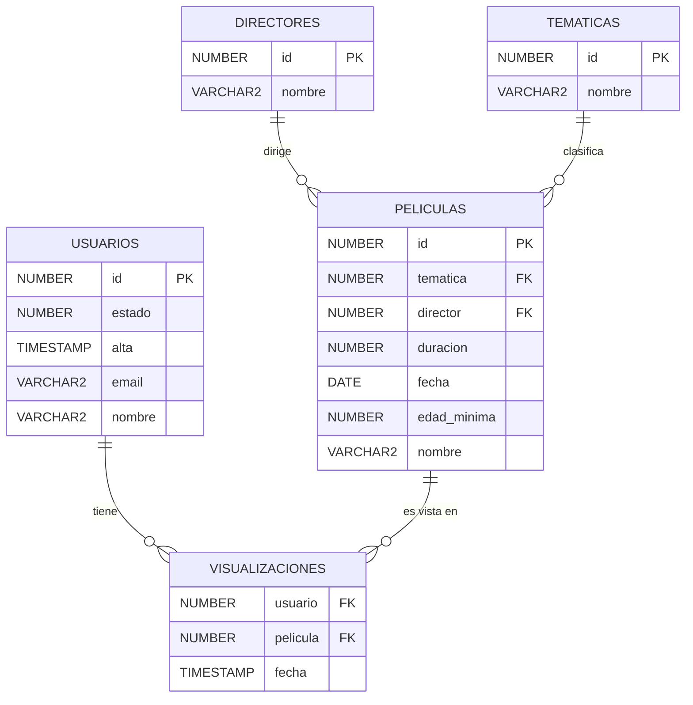

# Modelo de mi BBDD

Esta base de datos está diseñada para almacenar información sobre películas, sus directores, temáticas y los usuarios que las visualizan. A continuación se presenta el modelo entidad-relación (ER) que describe la estructura de la base de datos.

## Entidades y Atributos
- **USUARIOS**
  - `id`: Identificador único del usuario (PK)
  - `estado`: Estado del usuario (activo, inactivo, etc.)
  - `alta`: Fecha de alta del usuario
  - `email`: Correo electrónico del usuario
  - `nombre`: Nombre del usuario

